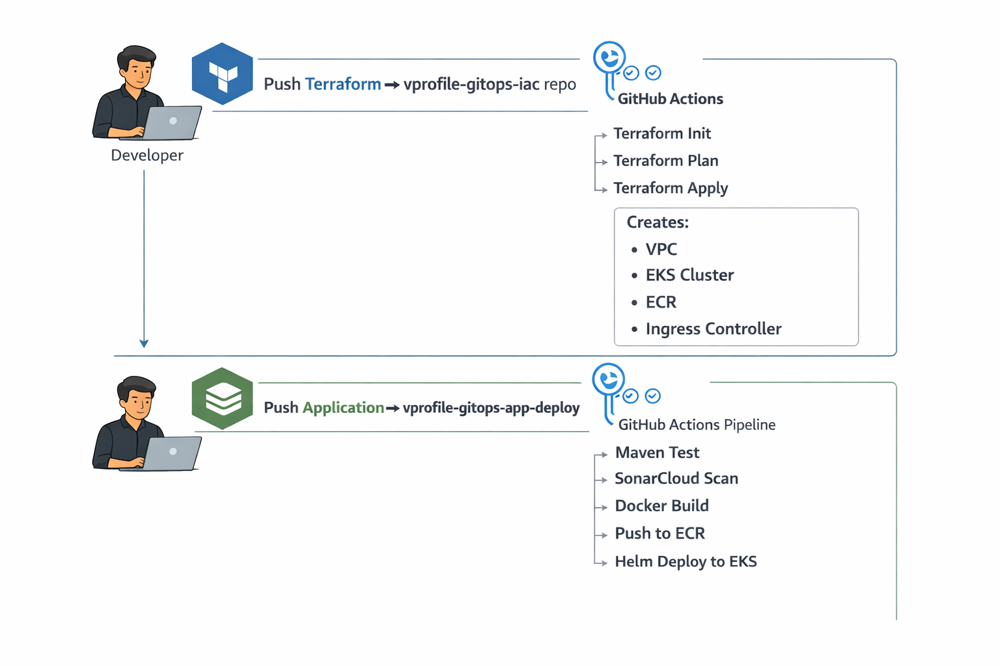
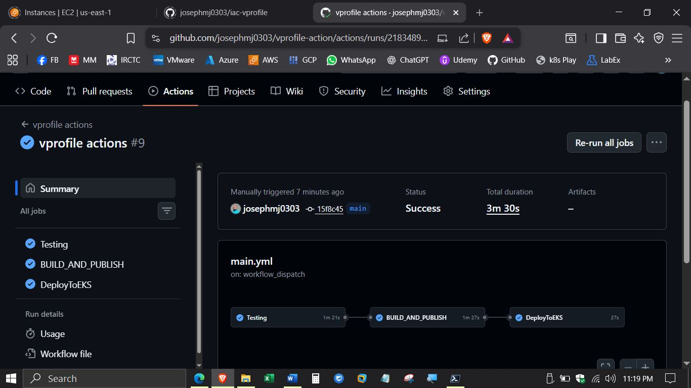

# VProfile GitOps Deployment Platform on AWS EKS

## Overview

This project demonstrates a complete production-grade GitOps platform for deploying and managing the VProfile application on AWS EKS using Terraform, GitHub Actions, Docker, Helm, and Amazon ECR.

The platform separates infrastructure provisioning and application deployment into independent repositories, implementing proper GitOps architecture used in real-world production environments.

## Related Repositories

This GitOps platform consists of separate repositories for infrastructure and application deployment:

| Repository | Description |
|----------|-------------|
| [vprofile-gitops-iac](https://github.com/josephmj0303/vprofile-gitops-iac) | Terraform infrastructure provisioning for AWS EKS |
| [vprofile-gitops-app-deploy](https://github.com/josephmj0303/vprofile-gitops-app-deploy) | CI/CD pipeline and Kubernetes deployment using GitHub Actions and Helm |

These repositories work together to implement a complete GitOps deployment platform.

---

## GitOps Architecture



```
Developer
   │
   ├── Push Terraform → vprofile-gitops-iac repo
   │       │
   │       └── GitHub Actions
   │              ├── terraform init
   │              ├── terraform plan
   │              └── terraform apply
   │                       │
   │                       └── Creates:
   │                             - VPC
   │                             - EKS cluster
   │                             - ECR
   │                             - Ingress controller
   │
   └── Push Application → vprofile-gitops-app-deploy repo
           │
           └── GitHub Actions pipeline
                  ├── Maven Test
                  ├── SonarCloud scan
                  ├── Docker build
                  ├── Push to ECR
                  └── Helm deploy to EKS

```
---
## 🔁 Deployment Workflow


---

## Repository Structure

This platform consists of two main repositories:

---

### Infrastructure Repository

Repository:

https://github.com/josephmj0303/vprofile-gitops-iac

Purpose:

Manages infrastructure provisioning using Terraform.

Responsibilities:

- Provision AWS VPC
- Provision Subnets
- Provision Internet Gateway
- Provision EKS Cluster
- Provision Node Groups
- Provision ECR Repository
- Configure IAM Roles
- Install Kubernetes Ingress Controller

Technology Used:

- Terraform
- AWS EKS
- AWS VPC
- AWS IAM
- GitHub Actions

---

### Application Deployment Repository

Repository:

https://github.com/josephmj0303/vprofile-gitops-app-deploy


Purpose:

Manages CI/CD pipeline and Kubernetes deployment.

Responsibilities:

- Run unit tests
- Perform SonarCloud analysis
- Build Docker image
- Push Docker image to ECR
- Deploy application to EKS using Helm

Technology Used:

- Docker
- Kubernetes
- Helm
- GitHub Actions
- SonarCloud
- Maven

---

## Repository Layout
```
vprofile-gitops-eks-platform/
│
├── README.md
│
├── architecture/
│     ├── gitops-architecture.png        ← Dev → Repo → CI/CD
│     └── aws-resource-diagram.png       ← AWS infra layout
│
└── screenshots/
      ├── cache-miss.png
      ├── app-home.png
      ├── app-login.png
      ├── cache-hit.png
      └── github-actions-success.png
```
---

## Technology Stack

### Cloud Provider

- AWS

### Infrastructure

- Terraform
- AWS EKS
- AWS VPC
- AWS ECR

### CI/CD

- GitHub Actions

### Containerization

- Docker

### Orchestration

- Kubernetes
- Helm

### Code Quality

- SonarCloud

### Application Stack

- Java
- Tomcat
- MySQL
- Memcached
- RabbitMQ

---

## GitOps Principles Implemented

This platform implements core GitOps principles:

- Infrastructure as Code
- Declarative configuration
- Git as single source of truth
- Automated deployments
- Version-controlled infrastructure
- Immutable deployments
- Automated rollback capability

---

## CI/CD Workflow

Infrastructure Deployment Workflow:

Push Terraform Code → GitHub Actions → Terraform Apply → AWS Infrastructure Created


Application Deployment Workflow:

Push Application Code → GitHub Actions → Test → SonarCloud Scan →
Docker Build → Push to ECR → Helm Deploy → Application Running on EKS


---

## AWS Resources Created

Infrastructure includes:

- VPC
- Public and Private Subnets
- Internet Gateway
- Route Tables
- EKS Cluster
- Node Groups
- ECR Repository
- Load Balancer
- IAM Roles

---

## Kubernetes Components Deployed

Application deployment creates:

- Kubernetes Deployment
- Kubernetes Service
- Kubernetes Ingress
- ConfigMaps
- Secrets

Managed using Helm.

---

## Application Architecture

Application components:

- Frontend: Java Web Application
- Database: MySQL
- Cache: Memcached
- Messaging: RabbitMQ

Cache improves performance by reducing database load.

---
## 📸 Application Screenshots

### Home Page


### Login Page


### Cache Hit


### Cache Miss


### Success Deployment


---

## Deployment Strategy

This platform uses:

- Immutable container deployments
- Automated CI/CD pipelines
- Helm-based Kubernetes deployment
- Git-based version control

---

## Use Case

This platform simulates a real-world enterprise deployment scenario where:

- Infrastructure is managed using Terraform
- Applications are deployed using CI/CD pipelines
- Kubernetes manages container orchestration
- Git serves as the single source of truth

This approach is widely used in production environments.

---

## Benefits

- Fully automated infrastructure provisioning
- Fully automated application deployment
- Version-controlled infrastructure and applications
- Easy rollback capability
- Highly scalable architecture
- Production-ready deployment model
- Reduced manual intervention

---

## Future Improvements

Planned enhancements:

- Add ArgoCD for continuous GitOps deployment
- Add Prometheus and Grafana monitoring
- Add centralized logging using ELK stack
- Implement Blue-Green deployment strategy
- Implement Canary deployments
- Add Horizontal Pod Autoscaler
- Add multi-environment support (dev, stage, prod)
- Integrate AWS Secrets Manager

---

## Skills Demonstrated

This project demonstrates expertise in:

- GitOps
- Terraform
- AWS EKS
- Kubernetes
- Helm
- Docker
- GitHub Actions
- CI/CD
- Infrastructure as Code
- Cloud Architecture
- Containerization
- Automation

---

## How to Use This Platform

Step 1: Deploy infrastructure using:

vprofile-gitops-iac repository

Step 2: Deploy application using:

vprofile-gitops-app-deploy repository

Application will be automatically deployed to Kubernetes.

---

## Conclusion

This project demonstrates a complete production-grade GitOps deployment pipeline using Terraform, GitHub Actions, Docker, Helm, and AWS EKS, following modern DevOps best practices used in enterprise environments.

                      


